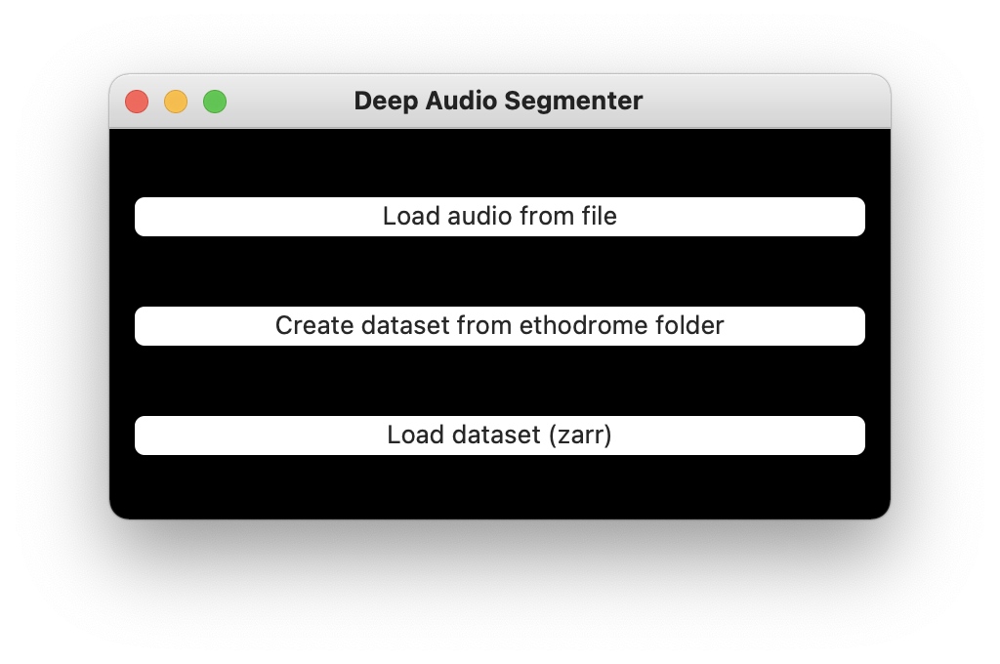
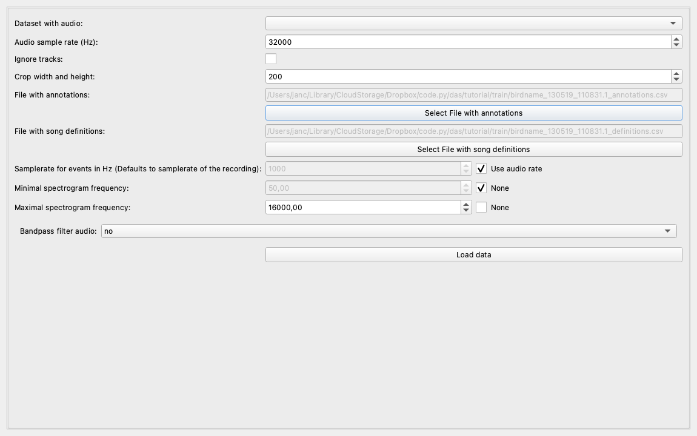
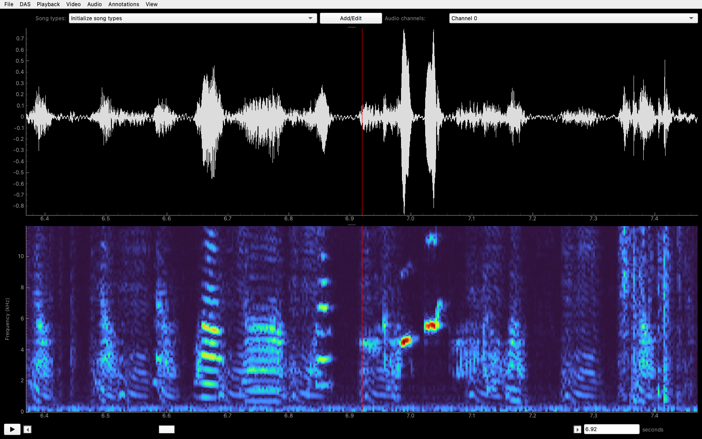
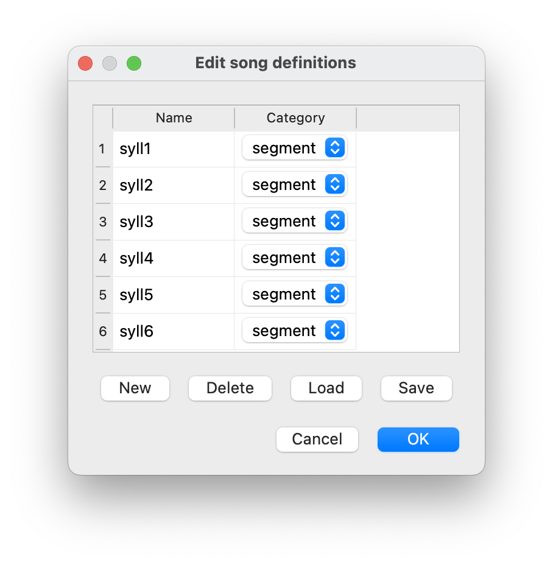
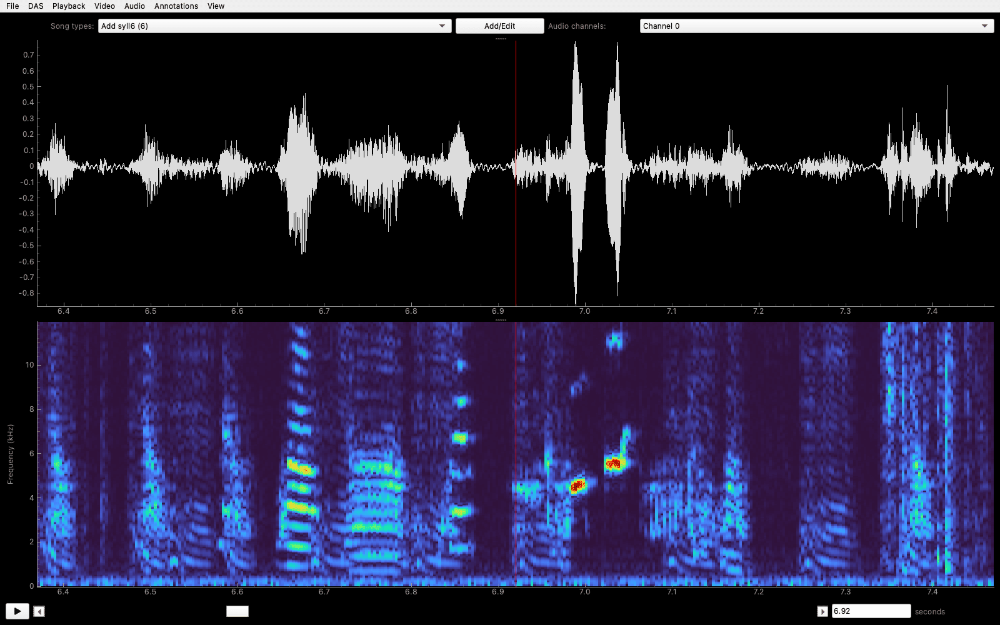
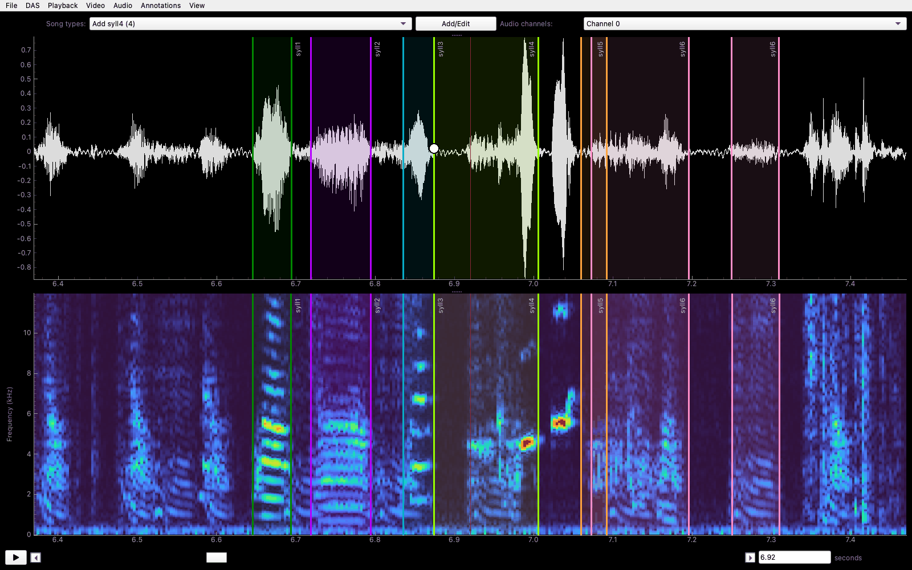
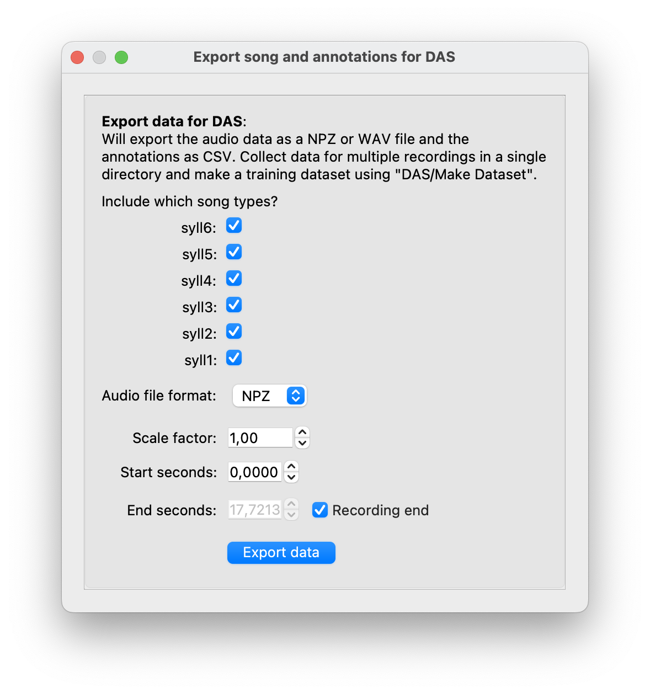
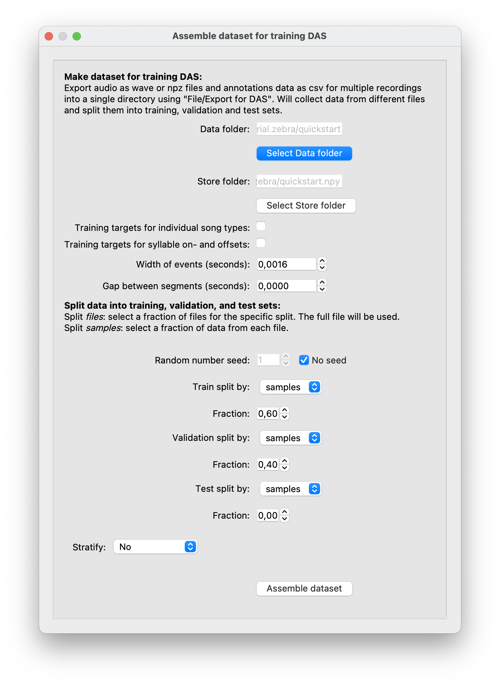
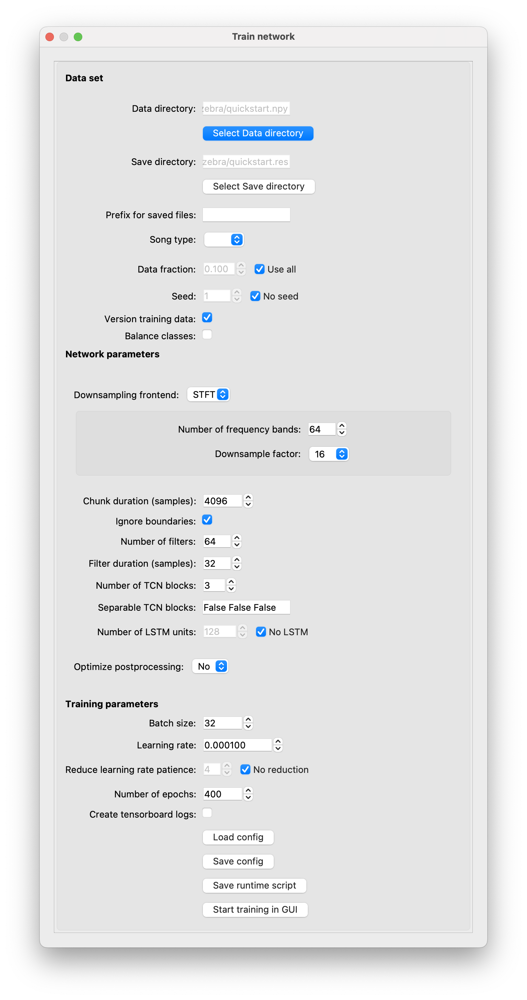
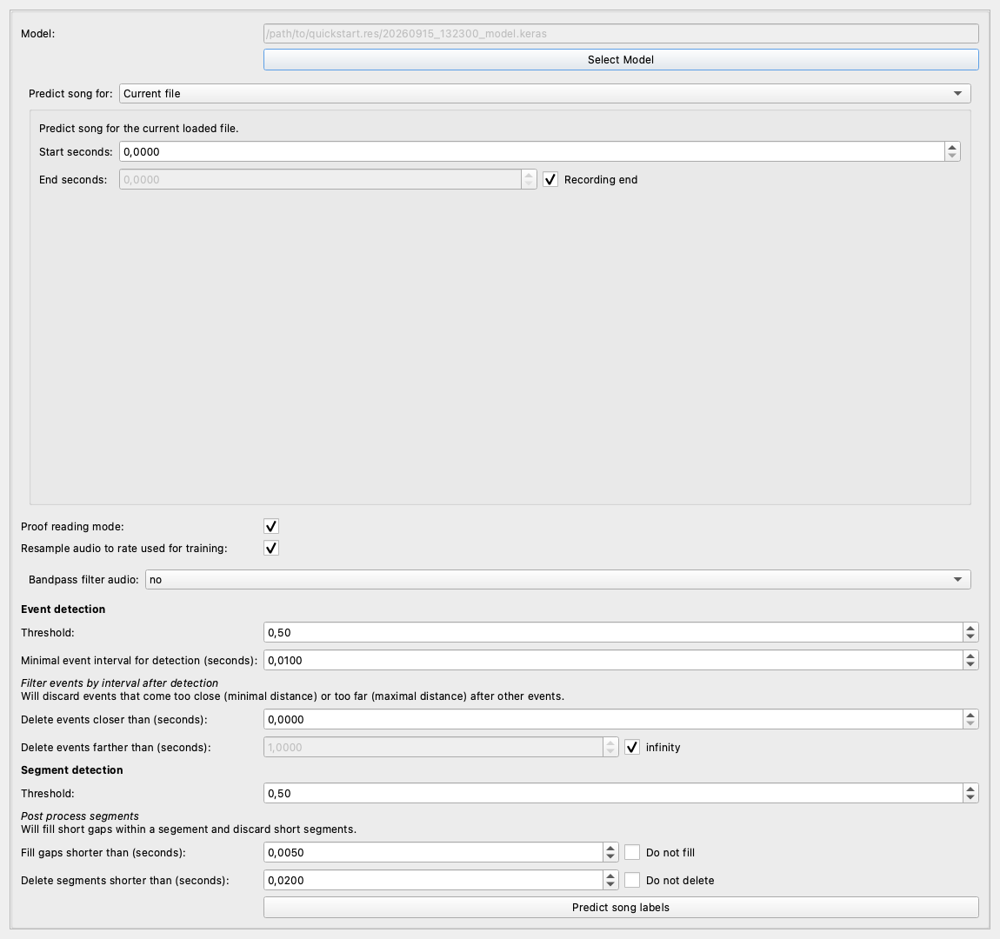

# Quick start tutorial (bird)

This quick start tutorial walks through all steps required to make _DAS_ work with your data, using recordings of zebra finch song as an example. A comprehensive description of all menus and options is available in the [GUI documentation](/tutorials_gui/tutorials_gui).

We will use an iterative annotation workflow: annotate a few song motifs, fast-train a network on those annotations, and use that network to propose annotations for a second recording. Correcting proposals is typically much faster than annotating everything from scratch. Repeat this annotate-train-predict cycle with progressively larger datasets until performance is satisfactory.

## Download example data

Download these two audio files from this tutorial:

- <a href="birdname_130519_110831.1.wav" download>birdname_130519_110831.1.wav</a> — training recording
- <a href="birdname_130519_113526.55.wav" download>birdname_130519_113526.55.wav</a> — test recording

The recordings are of a male zebra finch, recorded by Jack Goffinet et al. as part of [this dataset](https://research.repository.duke.edu/concern/datasets/9k41zf38g).

## Start the GUI

Install the PyPI version of _DAS_ following the [installation instructions](/installation). Then open a terminal, activate the conda environment created during installation, and start the GUI:

```shell
conda activate das
das gui
```

The following window should open:

:::{figure-md} xb_bird_start-fig


Start screen.
:::

## Load audio data

Choose _Load audio from file_ and select the training recording, `birdname_130519_110831.1.wav`.

In the dialog that opens, leave the automatically detected audio sample rate unchanged. Leave the annotation and song-definition fields at their defaults, select _Use audio rate_, and load the data.

:::{figure-md} xb_bird_load-fig


Loading the training recording.
:::

## Waveform and spectrogram display

Loading the audio opens a window that displays the waveform (top) and spectrogram (bottom).

Move forward or backward with `D` or `A`, and zoom in or out with `W` or `S` (see also the _Playback_ menu). You can also navigate with the scroll bar below the spectrogram or jump to a time using the field to its right. Adjust the temporal and frequency resolution of the spectrogram with `R` and `T`.

Play the displayed audio through your headphones or speakers by pressing `E`.

:::{figure-md} xb_bird_display-fig


Waveform (top) and spectrogram (bottom) of zebra finch song.
:::

## Initialize syllable types

Before annotating, register the six syllable types in this bird's motif. Open the editor with the _Add/Edit_ button above the plots or via _Annotations/Add or edit song types_, and create six segment types named `syll1` through `syll6`.

:::{figure-md} xb_bird_make-fig


Create six syllable types for annotation.
:::

## Create annotations manually

Select a syllable type from the menu above the plots. You can also switch types with the number keys shown in that menu—in this case `1` through `6`.

Annotate a syllable by left-clicking the waveform or spectrogram twice: once at the onset and once at the offset.

:::{figure-md} xb_bird_create-fig


Left-click at each syllable's onset and offset to create annotations.
:::

## Edit annotations

Correct a syllable boundary by dragging it. Drag the shaded segment itself to move the syllable without changing its duration. Movement can be disabled or restricted to the selected syllable type in the _Annotations_ menu.

Delete an annotation with a right-click. You can also delete all annotations in view with `U`, or only annotations of the selected type with `Y`. Change an annotation's label by selecting the desired type and using CMD/CTRL+left-click on the annotation.

:::{figure-md} xb_bird_edit-fig


Drag to correct boundaries or move segments; right-click to delete.
:::

## Export annotations and make a dataset

Once you have annotated the six syllables in all 14 motifs of the training recording, you can train a network to help annotate more data.

Training requires audio and annotations in a [specific format](technical/data_formats). Export them via _File/Export for DAS_ to a new folder—not the folder containing the original audio. Name the new folder `quickstart`.

:::{figure-md} xb_bird_export-fig


Export audio and annotations for the complete recording.
:::

Next, choose _DAS/Make dataset for training_ and select the `quickstart` folder. For this small initial dataset, use the annotations for training and validation only: set the training split to 0.60, validation split to 0.40, and test split to 0.0.

:::{figure-md} xb_bird_assemble-fig


Make a dataset for training.
:::

This creates a dataset named `quickstart.npy` containing the audio and annotations in the format required for training.

## Fast training

Choose _DAS/Train_, select the `quickstart.npy` dataset, and configure the network. For this fast training run, change:

- _Chunk duration (samples)_ to `4096`
- _Number of filters_ to `64`
- _Filter duration (samples)_ to `32`

:::{figure-md} xb_bird_train-fig


Training options.
:::

Select _Start training in GUI_. Training runs in a background process, and a small window and the terminal show its progress. Runtime depends strongly on your computer; a GPU is recommended for larger datasets.

## Predict

When training finishes, load the test recording, `birdname_130519_113526.55.wav`. Choose _DAS/Predict_, select the trained model in the `quickstart.res` folder, and choose the file ending in `_model.keras`.

In the prediction dialog:

- Leave _Start seconds_ at `0` and _Recording end_ selected to predict the complete test recording.
- Keep _Proof reading mode_ enabled. Predictions will be named `syll1_proposals` through `syll6_proposals` until you approve them.
- Enable _Fill gaps shorter than (seconds)_ by clearing _Do not fill_, and set the value to `0.005`.
- Enable _Delete segments shorter than (seconds)_ by clearing _Do not delete_, and leave the value at `0.020`.

:::{figure-md} xb_bird_predict-fig


Predict annotations for the complete test recording.
:::

Prediction is much faster than training and does not require a GPU. Most proposed syllables should be detected correctly, but there may be false positives, missed or confused syllables, and imprecise boundaries.

## Proofread

Correct the proposals: add missed syllables, delete false positives, fix label errors, and adjust syllable boundaries using the annotation tools described above. Once all proposals in view are correct, approve them with `H`.

## Repeat from export

Export the approved annotations for this recording into the same `quickstart` folder. Make a new dataset, train again, predict more data, and repeat. When prediction performance is adequate, fully train the network with a separate recording reserved as a test set and with more training epochs.
